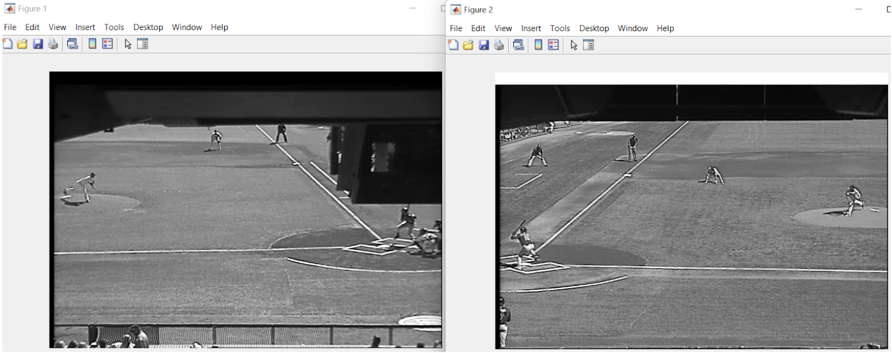
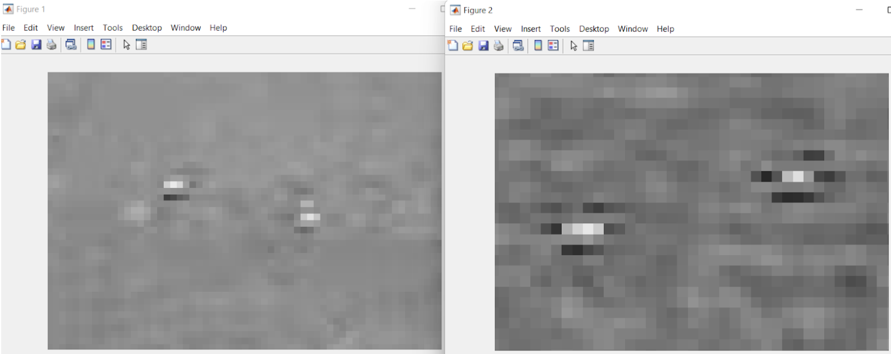
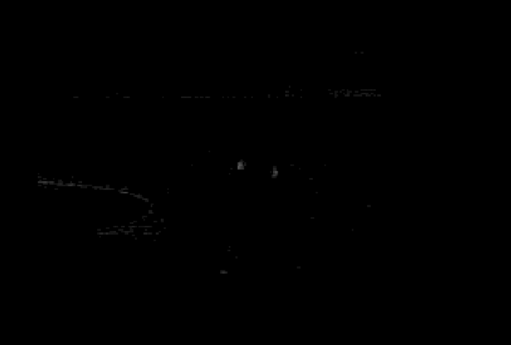
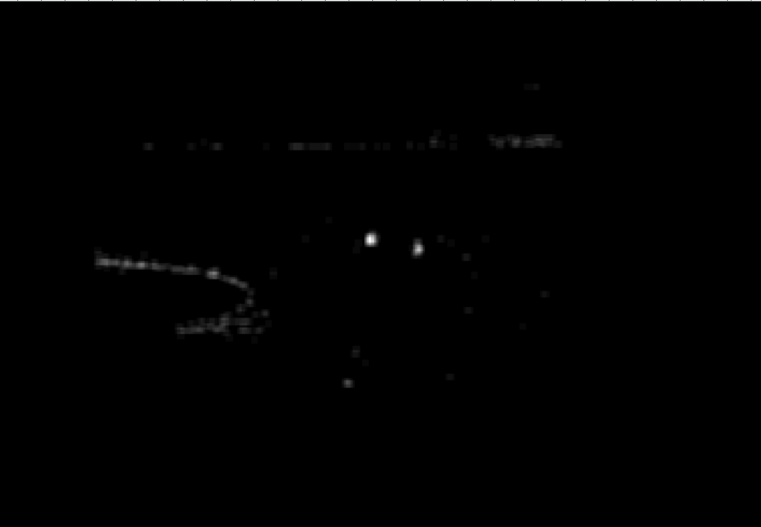
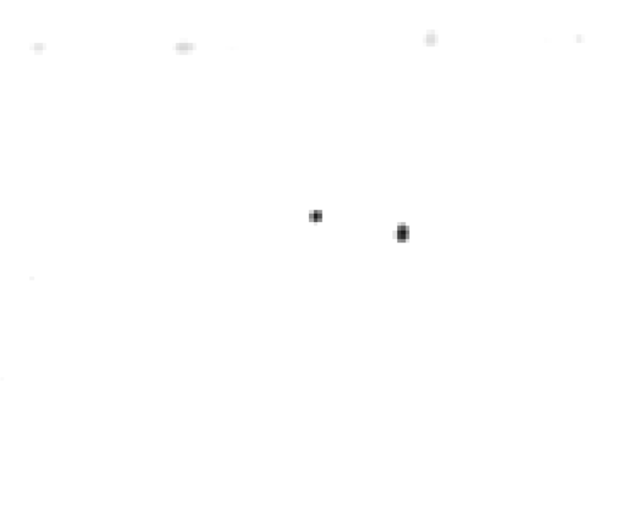
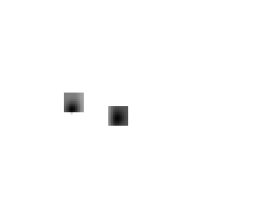

# Baseball-Tracker

Videos were taken from two different cameras in the stadium. Each pair of frames will be similar to the following.

The resolution of the videos is very low, leading the balls to appear as stripes of pixels that differ from their surroundings.

## Step 1: Detect edges
Due to the appearance of the balls, the best way to detect edges was by taking the absolute difference between each pixel and the one directly below. This was far more effective than a horizontal line detection kernel.

## Step 2: Blur
A Gaussian blur was applied to the results of Step 1 (convolved with a 3x3 kernel filled with 1/7s) to give the balls a more uniform shape to allow for a template to be created.

## Step 3: Template matching
A ball template was created for each camera by averaging the pixel values of several different balls relative to the center of the ball.

## Step 4: Enhance prediction from trajectory

